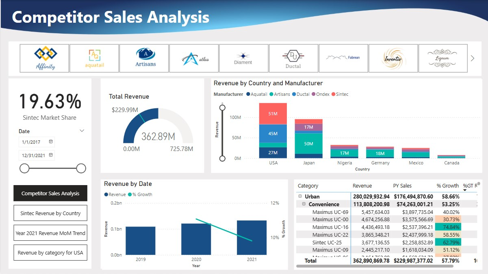
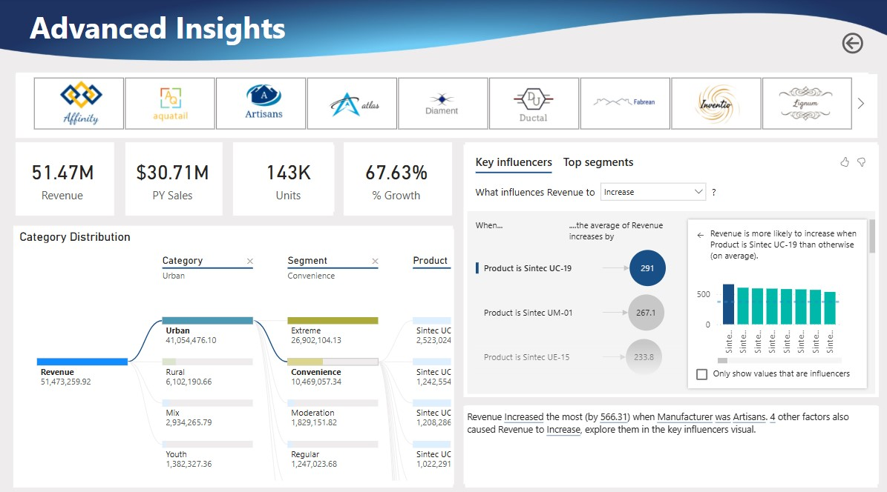

# Competitor Sales Analysis in Power BI

**Case study scenario:**

- Analyze manufacture’s sales internally
- Comparing sales against other competitors
- Comparing product performance against other competitors

**Discovering business insights**

1. Using top N list to identify major competitors.
2. Choosing the Stacked column chart to see how the values of each manufacturer contribute to the totals.
3. Select an appropriate visual that displays Revenue over time (Clustered Column chart). Add slicers and ensure Data labels, Target labels, and Callout value are all enabled.
4. Add some more dimensions and create a hierarchy of Category, Segment, Product to analyze in-deep about Revenue (using Matrix visual)
5. To show the sales growth and the rate at which a product can increase the revenue from sales, using DAX calculations. Select the matrix visual and drag PY Sales and %Growth in values section.
6. Apply conditional formatting rule

  

**Creating a Data-driven story**

Sintec’s marketing department has asked to keep the report design and UI in line with the company’s standard guidelines and provide with a color theme In this project.

1. Change the manufacturer slicer from drop down to list. Add the actual logos of the manufacturer into slicer.
2. Upload customized theme. Add title and change font.
3. Using bookmarks and Spotlights feature will highlight specific visuals and present them in a story.
4. Apply advanced AI-based visualizations to make analyze more robust.
5. Add more functionality of drill through to help end users focus on a specific entity.

## Conclusion

1. Sintec has total market share of 38.22% in the USA.
2. The highest growth of 18.8% in 2021 compared to last year.
3. Artisans is generating revenue with over 50% of the market share in Germany.
4. Sintec has 21.15% of the total market share across the globe.